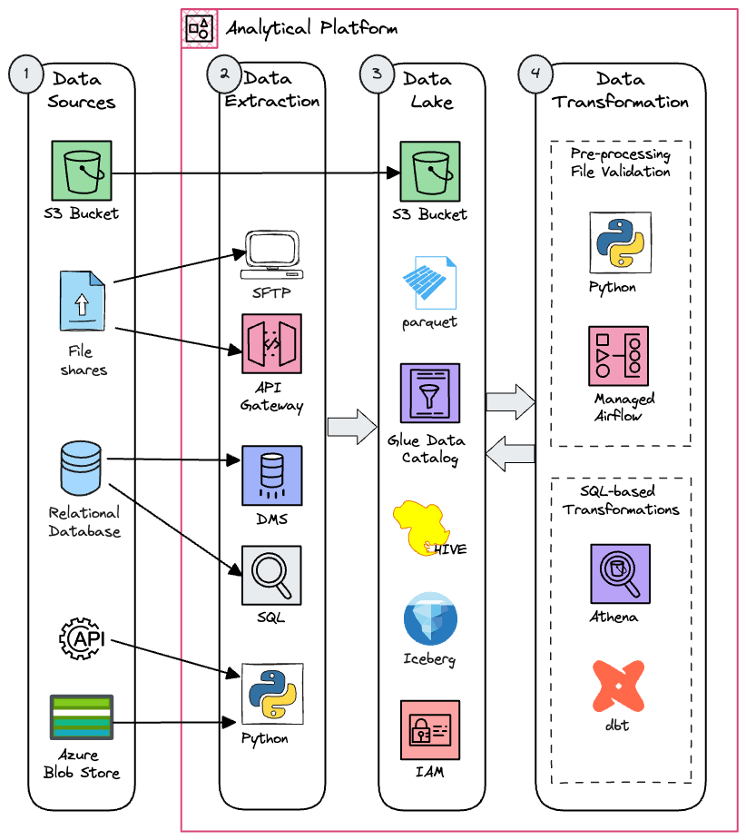

## Context

As explained in the [About](../) page, our data and analytics engineers develop analytical pipelines and self-service tools to acquire and transform data, making it available on the [Analytical Platform](https://user-guidance.analytical-platform.service.justice.gov.uk). We implement a [data lake](https://aws.amazon.com/what-is/data-lake/)-centric approach to manage our data, using a cloud-based [object store](https://aws.amazon.com/what-is/object-storage/) for storage. The pipelines follow a standard ['ELT' process](https://en.wikipedia.org/wiki/Extract,_load,_transform) (Extract, Load, Transform), producing cleaner, more standardized data in the format that downstream analysts expect, ensuring reliability.

Data engineers are responsible for extracting, standardising and loading source data into the Analytical Platform. Analytics engineers then apply [data modelling](https://en.wikipedia.org/wiki/Data_modeling) techniques to further refine the data, making it more conformed and accessible. Data users can then consume this transformed data, apply further processing or machine learning tasks, and disseminate their findings through reports or dashboards.

We can summarise this workflow using the [Medallion architecture](https://medium.com/@junshan0/medallion-architecture-what-why-and-how-ce07421ef06f), in which data transitions through Bronze, Silver, and Gold layers, increasing in structure and quality at each stage:

## Key Tools and Services

We use various tools to extract and transform our data, depending on the data source, volume, frequency and various other characteristics. To support this infrastructure, we rely on different open source tools and [AWS services](https://aws.amazon.com/blogs/big-data/aws-serverless-data-analytics-pipeline-reference-architecture/) to ensure scalability, resilience, security, and cost-effectiveness.

The data and analytics engineering container diagram summarises some of these tools and services:

1. Data and metadata is collected from multiple data sources across the MoJ and external to the MoJ, including [Amazon S3](https://aws.amazon.com/s3/), file shares, relational databases, APIs, and [Azure Blob Storage](https://azure.microsoft.com/en-gb/products/storage/blobs).

2. This data is ingested into our data lake using various approaches depending on the data source for example [AWS Database Migration Service (AWS DMS)](https://aws.amazon.com/dms/) for relational databases, [SFTP](https://en.wikipedia.org/wiki/SSH_File_Transfer_Protocol) for file shares or [Amazon API Gateway](https://aws.amazon.com/api-gateway/). Data in Amazon S3 can be imported directly.

3. The Data Lake consists of Amazon S3 for data storage, [AWS Glue Data Catalog](https://docs.aws.amazon.com/glue/latest/dg/catalog-and-crawler.html) as a metadata repository, [Apache Hive and Iceberg table formats](https://aws.amazon.com/what-is/apache-iceberg/) to provide a SQL-like interface, and [AWS IAM](https://aws.amazon.com/iam/) to secure access to the data.

4. We use [Amazon Athena](https://aws.amazon.com/athena/) along with [dbt](https://www.getdbt.com/) for SQL-based transformations. Data can be pre-processed using Python scheduled with [Amazon Managed Workflows for Apache Airflow](https://aws.amazon.com/managed-workflows-for-apache-airflow/). We also make these transformation tools available to data users to run their own analytical workflows, including machine learning workflows. The transformed data is then saved back to the data lake.

For more details about our technology stack, please visit our [Technology Radar](https://moj-analytical-services.github.io/data-and-analytics-engineering-tech-radar/).