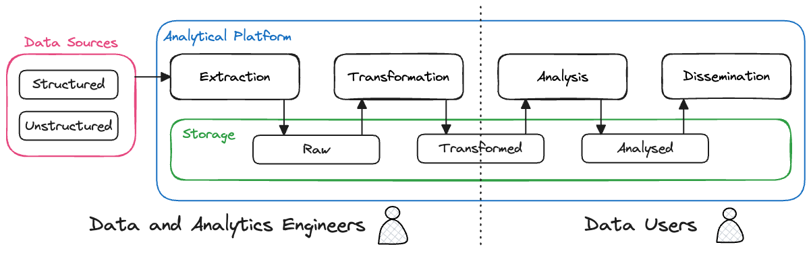

## Context

Our data and analytics engineers develop analytical pipelines and self-service tools to acquire and transform data, making it available on the [Analytical Platform](https://user-guidance.analytical-platform.service.justice.gov.uk). Data can be structured or unstructured, and originate from various sources with varying levels of quality. The pipelines implement the steps of a typical ['ELT' process](https://en.wikipedia.org/wiki/Extract,_load,_transform) (Extract, Load, Transform), producing cleaner, more standardized data in the format that downstream analysts expect, ensuring reliability. These steps allow experienced MoJ data users, such as Data Analysts and Data Scientists, to derive valuable insights with less time spent on data pre-processing. Data users can then disseminate the analyzed data through reports or dashboards. The data and analytics engineering context diagram summarises these steps:

## Key Tools and Services

We implement a [data lake](https://aws.amazon.com/what-is/data-lake/)-centric approach to manage our data, using a cloud-based [object store](https://aws.amazon.com/what-is/object-storage/). We use various tools to extract and transform our data, depending on the data source, volume, frequency and various other characteristics. To support this infrastructure, we rely on various [AWS serverless and managed services](https://aws.amazon.com/blogs/big-data/aws-serverless-data-analytics-pipeline-reference-architecture/) to ensure scalability, resilience, security, and cost-effectiveness.

The data and analytics engineering container diagram summarises some of these tools and services:

1. Data and metadata is collected from multiple data sources across the MoJ and external to the MoJ, including [AWS S3](https://aws.amazon.com/s3/), file shares, relational databases, APIs, and [Azure Blob Storage](https://azure.microsoft.com/en-gb/products/storage/blobs).
2. This data is ingested into our data lake using various approaches depending on the data source for example [AWS Database Migration Service (AWS DMS)](https://aws.amazon.com/dms/), [SFTP](https://en.wikipedia.org/wiki/SSH_File_Transfer_Protocol) or [Amazon API Gateway](https://aws.amazon.com/api-gateway/).
3. The Data Lake consists of Amazon S3 for data lake storage, [AWS Glue Data Catalog](https://docs.aws.amazon.com/glue/latest/dg/catalog-and-crawler.html) as a metadata repository, [Apache Hive and Iceberg](https://aws.amazon.com/what-is/apache-iceberg/) to provide a SQL-like interface, and [AWM IAM](https://aws.amazon.com/iam/) to secure access to the data.
4. We use [Amazon Athena](https://aws.amazon.com/athena/) along with [dbt](https://www.getdbt.com/) for SQL-based transformations. Data can be pre-processed using Python scheduled with [Amazon Managed Workflows for Apache Airflow](https://aws.amazon.com/managed-workflows-for-apache-airflow/). We also make these tools available to data users to run their own analytical workflows, including machine learning workflows. The transformed data is then saved to the data lake.
