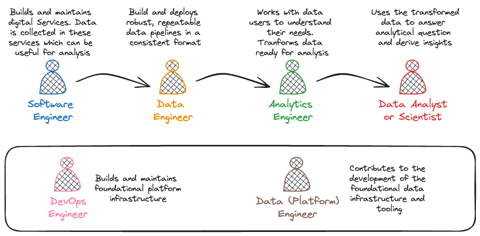

Data and analytics engineers enable data-driven decision making and the personalisation of services across the department by delivering innovative solutions and promoting technical excellence.

We bridge the gap between data producers and data users, developing analytical pipelines and self-service tools to acquire and transform data, making it available on the [Analytical Platform](https://user-guidance.analytical-platform.service.justice.gov.uk).

This diagram helps to summarise some of these different roles:

## Data Engineering

### What do we do?

We work with digital teams to help them make data from their services available on the [Analytical Platform](https://user-guidance.analytical-platform.service.justice.gov.uk/index.html).

We validate, deduplicate and standardise the extracted data to produce curated data sets. Where possible, we provide historical data to support reproducible and longitudinal analysis. 

We do this by building and running data pipelines ourselves, and by supporting digital teams to use self-service tools and infrastructure on the Analytical Platform. 

We also collaborate with platform teams, contributing to the development of the Analytical Platform and other foundational data infrastructure, including the [data uploader](https://user-guidance.analytical-platform.service.justice.gov.uk/tools/data-uploader/index.html), [Airflow](https://user-guidance.analytical-platform.service.justice.gov.uk/tools/airflow/index.html), [Create a Derived Table](https://user-guidance.analytical-platform.service.justice.gov.uk/tools/create-a-derived-table/index.html), [Register my Data](https://github.com/ministryofjustice/register-my-data) (internal only) and the [data extractor](https://github.com/ministryofjustice/data-engineering-data-extractor) (internal only).

### What value do we provide?

We enable access to data in a way that is more reliable, secure, auditable and timely than was ever previously possible. 

Analysts and data scientists can access complete data from a range of sources in a single location and in a standardised format, reducing preparation time.

Data can now be received daily, instead of weekly, monthly or quarterly, generating insight that is more relevant and current.

## Analytics Engineering

### What do we do?

Analytics engineers start with the curated data provided by data engineers.

We work with analytical users (usually analysts, data scientists and statisticians) to understand how they use data, so that we can design and build derived tables to meet their needs.

To build derived tables we clean, join and transform the curated tables produced by data engineers, using dimensional modelling and implementing tests and documentation to ensure that the output is reliable and understandable.

### What value do we provide?

The derived tables that we produce accelerate the production of statistics, management information (MI), analysis, and data science products.

Analysts and data scientists need to spend less time transforming and understanding complex and messy data sets, so they can start deriving insights faster and make better use of their technical skills to solve new problems.

Derived data is trusted and consistent across use cases, meaning we get the same answers to the same questions no matter where we ask them.

Data is domain-aligned, not source-aligned, facilitating a simpler transition from heritage systems to new services.
