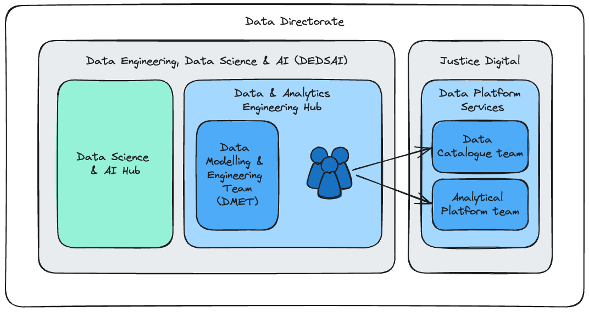
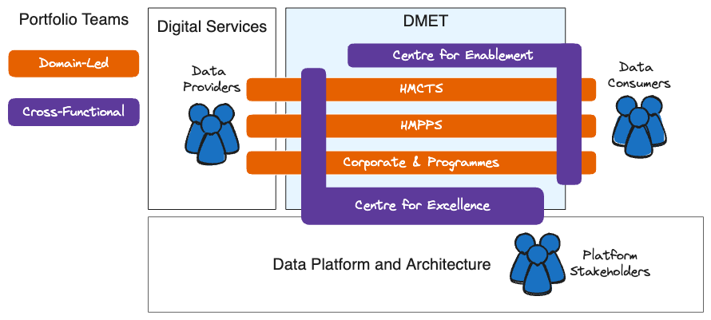

# Team Structure

Data and analytics engineers in the MoJ work across various teams:

- The Analytical Platform team, which maintains the MoJ [Analytical Platform](https://user-guidance.analytical-platform.service.justice.gov.uk/#content).
- The Data Catalogue team, which maintains the MoJ [Data Catalogue](https://user-guidance.analytical-platform.service.justice.gov.uk/#content).
- The Data Modelling and Engineering team (DMET), which delivers solutions to internal stakeholder needs across the MoJ.

Data and analytics engineers belong to the same Data directorate, as summarised in this diagram:

## Data Modeling Engineering Team (DMET)

DMET is divided into multiple portfolio teams, each with a specific focus. The domain-led teams work closely with data providers and consumers from specific domains to understand their requirements and ensure their needs are met. Meanwhile, the cross-functional teams collaborate across team boundaries to promote best practices and maintain alignment.

## Portfolio

We manage and maintain analytical databases and tools which enable effective and impactful analysis across the MoJ. Our portfolio includes the following areas:

#### HM Prison and Probation Service (HMPPS)

The HMPPS domain in Data and Analytics engineering, are responsible for providing users on the Analytical Platform access to data covering Prisons and Probation data for analytical purposes.

Internal only [link](https://justiceuk.sharepoint.com/:p:/r/sites/DataEngineeringDataScience/Shared%20Documents/General/1.%20Data%20%26%20Analytics%20Engineering%20Hub/3.%20Prison,%20Probation%20%26%20EM/hmpps_posters.pptx?d=w17120a8f29f2469cbfbe85be1a7049d2&csf=1&web=1&e=jX6jC7) to Show and Tell posters.

#### HM Courts and Tribunals Service (HMCTS)

Similarly to the HMPPS, the HMCTS domain in Data and Analytics engineering, are responsible for providing Data Scientists, Analysts, and Statisticians on the Analytical Platform access to court data covering Civil, Family, Tribunals, Magistrates, and Crown courts.

#### Corporate and Programmes

The Corporate & Programmes domain in Data and Analytics engineering, are responsible for providing users on the Analytical Platform access to data covering Finance, People and Commercial, as well as the BOLD and Data First programmes, for analytical purposes.

Internal only [link](https://justiceuk.sharepoint.com/:p:/s/DMETCorporate/EWYWM-dXQtlHguKF-Dnx8jUB8MsLZXWfamZ93GLF9cdhwA?e=S7fQ7s) to Show and Tell posters.

#### Centre for Excellence (CfE)

Our mission is to drive excellence and innovation in data and analytics engineering through continuous improvement, collaboration, and knowledge sharing.

We set the technical direction, prioritising addressing immediate challenges faced by domain teams and their partners.

You can read more about us in [these summary slides](https://moj-analytical-services.github.io/dmet-cfe/).

#### Centre for Enablement

Under construction!
