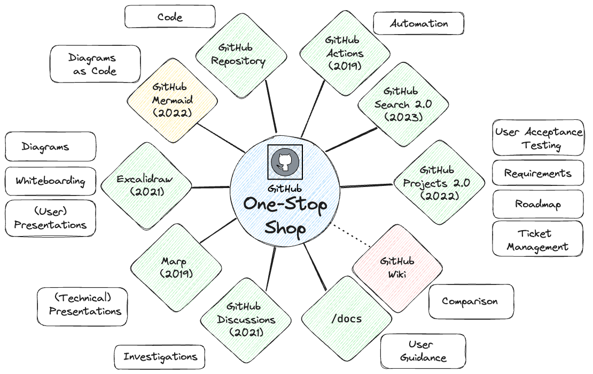

Many developers will be familiar with the following development environment setup: You use [GitHub repositories](https://docs.github.com/en/repositories/creating-and-managing-repositories/quickstart-for-repositories) to store and manage code, but rely on a plethora of tools for creating and managing all other project outputs. While each tool can be very effective in its own right, this often leads to scattered deliverables, causing confusion and an increased risk of inconsistencies. In this article, I outline how to consolidate all your project artefacts on GitHub by leveraging recent GitHub and open-source tools:

- [GitHub Projects](https://docs.github.com/en/issues/planning-and-tracking-with-projects/learning-about-projects/about-projects) for planning and tracking work
- [GitHub Discussions](https://docs.github.com/en/discussions) for documenting discovery work and communicating with users
- A `/docs` folder for documenting user guidance and technical concepts in Markdown
- [Mermaid](https://docs.github.com/en/get-started/writing-on-github/working-with-advanced-formatting/creating-diagrams) for creating simple diagrams using Markdown-like syntax
- [Excalidraw](https://excalidraw.com/) for creating editable diagrams and whiteboard sketches, which can be saved as code in a `/docs/images` folder
- [Marp](https://marp.app/) for creating slide decks in Markdown, which can be saved as code in a `/docs/presentation` folder

I've linked some examples from the [MoJ](https://mojdigital.blog.gov.uk/) in the Excalidraw whiteboard below:

[](https://excalidraw.com/#url=https://raw.githubusercontent.com/ministryofjustice/data-and-analytics-engineering/add-github-blog/src/content/blog/posts/images/github-one-stop-shop.excalidraw.png)

The article includes recommendations on how to use these tools as of February 2024. For more detailed and up-to-date instructions, please refer to the links provided.

# But first, why store everything in GitHub?

Compared to your existing setup, the tools discussed in this article may offer fewer features and require a steeper learning curve. Additionally, clear migration paths may be lacking, making it challenging to switch platforms.

However, there are several advantages which I feel make it worthwhile, especially if you're starting from scratch:

### Searchability

Having all your code, tickets, documentation, and presentations in one place makes it super easy to search through everything, *if you can find it*. Unfortunately GitHub search used to [suck](https://github.com/isaacs/github/issues/908), deterring all but the most hardcore users. Thankfully, GitHub rolled out a new search engine and browser in [May 2023](https://github.blog/2023-05-08-github-code-search-is-generally-available/), making it possible to find relevant results at reasonable speed. Knowing the [GitHub search syntax](https://docs.github.com/en/search-github/getting-started-with-searching-on-github/understanding-the-search-syntax) helps.

### Interoperability

Using GitHub tools exclusively makes it easier to link and automate across your project artefacts. Hence it makes it easier to track, review and deploy changes as well as collaborate with your team and users.

### Standardisation

Treating project [deliverables as code](https://thenewstack.io/why-docs-as-code-should-be-part-of-your-dev-cycle/) means you can leverage the same practices that are applied to software development: version control, automation, reusability and maintainability. This results in improved standardisation and quality across your projects and enterprise.

### Cost

Using fewer tools can lead to cost savings. However, this reason may be less significant if other teams in your company do not use GitHub and are unlikely to switch.

### Everything?!


Well not actually everything, for example:

- Large files, which can be stored in [Git LFS](https://docs.github.com/en/repositories/working-with-files/managing-large-files/about-git-large-file-storage)
- Keys and credentials, which should be stored in a secret management system

Which still leaves tracking and documentation.

# Project Management

The initial version of GitHub Projects, launched in [2016](https://github.blog/2016-09-14-a-whole-new-github-universe-announcing-new-tools-forums-and-features/), consisted primarily of a Kanban board. It lacked basic features such as a [backlog view](https://medium.com/momenton/jira-vs-github-issue-tracking-4cdf3bdd1437), warding off entreprise users. In [August 2022](https://github.blog/2022-07-27-planning-next-to-your-code-github-projects-is-now-generally-available/) GitHub released a revamped version of [GitHub Projects](https://docs.github.com/en/issues/planning-and-tracking-with-projects/learning-about-projects/about-projects), which offers a more intuitive, flexible, and customisable user interface. 

Users can now plan and track work using either a [table or board view](https://docs.github.com/en/issues/planning-and-tracking-with-projects/customizing-views-in-your-project/changing-the-layout-of-a-view). Projects are created at the GitHub organisation level, making them linkable to repositories but independent from them. Additionally, you can incorporate issues from [other GitHub organisations](https://github.blog/changelog/2023-02-23-github-issues-projects-february-23rd-update/#add-cross-organization-issues-and-pull-requests-to-projects), although there won't be a reciprocal link from the issue to the project. There are various ways to [automate](https://docs.github.com/en/issues/planning-and-tracking-with-projects/automating-your-project) projects. The simplest are the [built-in automations](https://docs.github.com/en/issues/planning-and-tracking-with-projects/automating-your-project/using-the-built-in-automations), which for example updates the status to `Done` when an issue is closed.

### Epics

[Epics](https://theproductmanager.com/topics/agile-epic/) are often used to structure agile backlogs and to break down large issues into more manageable work. GitHub offers three options for managing epics:

#### 1. Task lists

[Task lists](https://docs.github.com/en/get-started/writing-on-github/working-with-advanced-formatting/about-task-lists) have been around since [2014](https://github.blog/2013-01-09-task-lists-in-gfm-issues-pulls-comments/). GitHub is currently working on [a significant upgrade](https://docs.github.com/en/issues/managing-your-tasks-with-tasklists) which is still in private beta, so stay tuned for updates!

You can link to issues, pull requests and discussions within the same repository using the simple `#number` pattern: 

```
- [x] #739
- [ ] https://github.com/octo-org/octo-repo/issues/740
- [ ] Add delight to the experience when all tasks are complete :tada:
```


For cross-repository linking you'll need to specify the full url. You can also draft tasks until you're ready to convert them into issues, or leave them as-is for smaller tasks.

You can navigate back to the parent issue in the "Tracked by" section next to the child issue's status:


I recommend assigning an `Epic` label to parent issues to make them easier to identify. You can display the `Epic` label in GitHub Projects, and filter and search by the `Epic` label. Although GitHub Projects does not [yet](https://docs.github.com/en/issues/planning-and-tracking-with-projects/understanding-fields/about-tracks-and-tracked-by-fields) display relationships, it's easy to view by opening the issue screen:


#### 2. Milestones

[GitHub milestones](https://docs.github.com/en/issues/using-labels-and-milestones-to-track-work/about-milestones) can be associated with issues and pull requests, but not discussions. You can display milestones on GitHub Projects as an additional column, and add them to the GitHub Project [roadmap layout](https://docs.github.com/en/issues/planning-and-tracking-with-projects/customizing-views-in-your-project/changing-the-layout-of-a-view#about-the-roadmap-layout.). For more complicated projects which require a more nested hierarchy, you can group issue epics into milestones:


Note that cross-repository milestones [are not yet supported](https://github.com/orgs/community/discussions/6296). A workaround is to record all issues in a core repo, even if the code is split amongst multiple repos. This also makes it easier to manage work.

#### 3. Labels

Don't use [GitHub labels](https://docs.github.com/en/issues/using-labels-and-milestones-to-track-work/managing-labels) for epics! This may seem an obvious option at first, but unlike milestones you can't set dates, track completion status or close labels.

### Roadmaps

The GitHub Project [roadmap layout](https://docs.github.com/en/issues/planning-and-tracking-with-projects/customizing-views-in-your-project/customizing-the-roadmap-layout) displays the project items on a timeline. However, I prefer using the [board layout](https://docs.github.com/en/issues/planning-and-tracking-with-projects/customizing-views-in-your-project/customizing-the-board-layout), and grouping issues by quarter. You can modify the `status` field to store the quarter, as used in the [GitHub public roadmap](https://github.com/orgs/github/projects/4247). Alternatively you can create a separate `Quarter` field.

Using quarters instead of dates encourages product owners and delivery managers to follow good practice such as:

- Create epics which are shorter than a quarter
- Limit the number of epics undertaken per quarter
- Give less precise but more accurate start and completion dates

### Requirement Analysis

The [MoSCoW method](https://www.techtarget.com/searchsoftwarequality/definition/MoSCoW-method) prioritises project requirements by splitting them into *must haves*, *should haves*, *could haves* and *will not haves*. This can be done within GitHub Projects by creating a new `MoSCoW` field with the relevant labels. The items can start off as drafts, and can be later converted into issues once more fleshed out.

### User Acceptance Testing (UAT)

A typical UAT scenario involves migrating a large group of users to a new solution, and making sure that existing functionality is replicated. A simple way of tracking progress is through a spreadsheet with a row per user and columns for recording completion of different actions. Instead, we have successfully used GitHub Projects to track UAT progress. Those internal to MoJ can access this private [project](https://github.com/orgs/moj-analytical-services/projects/72/views/1) for tracking user migration to a new database as an example. For external users, the concept is straightforward: 

1. Create an [issue template](https://docs.github.com/en/communities/using-templates-to-encourage-useful-issues-and-pull-requests/configuring-issue-templates-for-your-repository) to outline the different actions
1. Generate a ticket for each artefact that needs to be migrated
1. Replace the `status` field with the different actions
1. Use the project board layout to track progress

The advantages are many:

- Assign tickets to GitHub user accounts, instead of named individuals
- Use a single issue to track progress and communication
- Take advantage of [GitHub automation](https://docs.github.com/en/issues/planning-and-tracking-with-projects/automating-your-project)

# Project Documentation

Documentation about your project can take many forms, which needs to be recorded and managed differently depending on the audience and use case.

### Documentation about your code

This is obvious and should reside in your code. Good code documentation practice is outside the scope of this article. You can refer to [this article](https://swimm.io/learn/code-documentation/documentation-in-python-methods-and-best-practices) for some great pointers on documenting python code.

### Documentation about your project  

This includes architecture, dependencies, setup instructions and user guidance. You should keep this information in GitHub as markdown files in a `/docs` folder in your GitHub repository. It's also possible to use [GitHub wikis](https://docs.github.com/en/communities/documenting-your-project-with-wikis), as has been successfully achieved [here](https://github.com/AstroBookings/.github/wiki). However I would not recommend for reasons which are best summarised in this [article](https://michaelheap.com/github-wiki-is-an-antipattern/). 

It's possible to convert your documentation into a static website using static site generators such as [mkdocs-material](https://squidfunk.github.io/mkdocs-material/) and host on [GitHub pages](https://docs.github.com/en/pages/getting-started-with-github-pages/about-github-pages). This is more relevant for external-facing documentation.

Whilst it's recommended for documentation to go through the same review process as code, it can sometimes feel onerous. You can modify the [codeowners](https://docs.github.com/en/repositories/managing-your-repositorys-settings-and-features/customizing-your-repository/about-code-owners) to skip the approval process for changes to the `/docs` folder. You can also modify [GitHub workflows](https://docs.github.com/en/actions/using-workflows/workflow-syntax-for-github-actions#onpull_requestpull_request_targetbranchesbranches-ignore) to skip the workflow, which is useful in the case of long running tests.  

A few things to note about structuring the `/docs` folder:

- With a monorepo layout, you can split off into multiple `/docs` folders at the root of each sub-folder, but this can make it more complex to manage and navigate
- With a multi-repo approach, you can use the 'core' repository or create a 'docs' repository for documenting team or application level documentation. You can't combine code and documentation changes made against different repositories in a single pull request, but you can still link them via a task list

### Documentation about your approach

When you're evaluating options or completing some analysis you often create temporary documentation. This type of documentation should be kept separate from your code to avoid clutter and confusion, especially for new team members. Your `/docs` folder should reflect the current state of your project, just like your code.

Instead, you can use [GitHub Discussions](https://docs.github.com/en/discussions/collaborating-with-your-community-using-discussions/about-discussions) which was released in [August 2021](https://github.blog/2021-08-17-github-discussions-out-of-beta/). Discussions are not enabled by default so you'll have to update the [repository settings](https://docs.github.com/en/repositories/managing-your-repositorys-settings-and-features/enabling-features-for-your-repository/enabling-or-disabling-github-discussions-for-a-repository). If you use a multi-repo approach, you can limit discussions to the core or docs repository to make it easier to track and search.

Unlike the `/docs` folder, discussions don't require approvals. Whilst it simplifies the workflow, it does mean that discussions can become an 'information swamp'. Hence you need a process for transferring sanitised information to the `/docs` folder. Luckily GitHub Discussions support the same [advanced formatting](https://docs.github.com/en/get-started/writing-on-github/working-with-advanced-formatting) as markdown pages, which makes it easy to copy and paste. I recommend closing a discussion once the information has been migrated to the `/docs` folder.

GitHub Discussions allows your users to [participate](https://docs.github.com/en/discussions/collaborating-with-your-community-using-discussions/participating-in-a-discussion) with the idea generation process through comments, reactions and polls. However, this means everyone involved will need to check their GitHub notifications regularly. It can also cause confusion if you already use another communication medium e.g. Slack. A good rule of thumb is to consider whether you might want to refer to this information in a year's time. If so, use a discussion!

### Diagrams

[Mermaid](https://github.com/mermaid-js/mermaid#readme) is a JavaScript-based tool that lets you create diagrams using a markdown-like syntax. GitHub released support for Mermaid in [February 2022](https://github.blog/2022-02-14-include-diagrams-markdown-files-mermaid/). It's particularly handy for adding editable diagrams to places like issues and discussions, as you don't have to save it to the `/docs` folder. However I found that Mermaid has a steep learning curve and limited options available so I would only suggest for simple diagrams. 

Instead, I recommend using [Excalidraw](https://excalidraw.com/), an open-source whiteboard tool. GitHub doesn't provide native support to Excalidraw, but you can export sketches as editable image files (PNG/SVG), or JSON preferably to limit file size. You can then embed these files directly into issues and discussions, or save to the `/docs/images` folder for version control. You can edit diagrams on the web editor or download the [VS Code extension](https://marketplace.visualstudio.com/items?itemName=pomdtr.excalidraw-editor) to edit locally. Excalidraw plus GitHub is also great for recording the outcome of collaborative whiteboard sessions, which often get lost otherwise.

### Presentations

[Marp](https://marp.app/) is a open-source ecosytem for creating slide decks in markdown. Similar to Excalidraw, GitHub does not provide native support, but you can download the [VS Code extension](https://marketplace.visualstudio.com/items?itemName=pomdtr.excalidraw-editor) to edit and preview markdown files locally. While there's a bit of a learning curve, once you've decided on a format it's very intuitive. We've used Marp to create three slide decks when [evaluating Iceberg](https://github.com/moj-analytical-services/iceberg-evaluation/tree/main/docs/presentations). Additionally, I've exported the `README.md` to HTML and hosted it on [GitHub Pages](https://moj-analytical-services.github.io/iceberg-evaluation/) for better visibility.

# Conclusion

Historically, GitHub has been mainly valued for source code management. Recent enhancements to the GitHub ecosystem, coupled with various open-source tools, make it possible to integrate tracking, code, and documentation within one platform. While there may be initial challenges, the long-term benefits include increased efficiency, consistency, and transparency.

If you have any comments or suggestions please post on the [discussion](https://github.com/ministryofjustice/data-and-analytics-engineering/discussions/10).

# Acknowledgements

I would like to thank the following people and resources:

- The managed pipelines crew for being so open to trying out new things!
- The Saturday Coding Club for providing insightful suggestions 
- @bagg3rs for introducing me to Excalidraw
- @julialawrence for encouraging me to give GitHub Projects another try
- @calumabarnett for making sure I follow the [GDS Style guide](https://www.gov.uk/guidance/style-guide/a-to-z-of-gov-uk-style)
- ChatGPT3.5 for proofreading and adding a touch of polish 