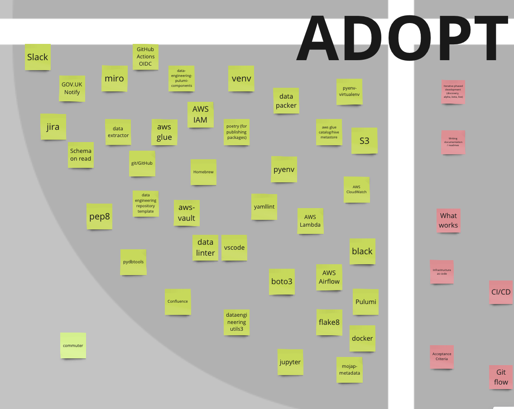

## The Balancing Act: Stability vs Innovation

As a data engineering team, we are constantly navigating an ever-evolving tech landscape. New tools, platforms, and techniques are constantly emerging, making it challenging to decide what to adopt, assess, or retire. While established technologies provide stability, relying on them too heavily risks stagnation and missed opportunities for innovation.

It’s easy to stick with what’s familiar – tried-and-tested tools offer stability and reliability. Yet clinging to old technologies can lead to stagnation, inefficiency, and missed opportunities for innovation. On the other hand, rushing to adopt shiny new tools can cause disruption, waste time, and create unnecessary complexity.

How do we decide what to adopt, assess, or retire?  
How do we explore new technologies without losing focus or creating unnecessary overhead?  
And how do we keep the team aligned and involved in these decisions?  

Enter the **technology radar**: a tool that brings structure and clarity to this balancing act.

A technology radar provides a shared framework for evaluating tools, platforms, and techniques. It helps teams identify emerging technologies worth exploring, recognise reliable tools that should remain part of the stack, and retire outdated solutions. More importantly, it fosters collaboration and transparency, ensuring that everyone has a say in shaping our technology choices.

This blog post explores our journey with the technology radar – why we adopted it, how we use it to balance stability with innovation, the enhancements we’ve introduced to existing approaches, and the key lessons we’ve learned along the way.

## Ok, so what is a technology radar?

A technology radar is a tool that maps out the key technologies your team is using or considering, represented as "blips". These blips are arranged into concentric rings - **Adopt, Assess, Retain, and Replace** - which reflect the status of each technology, indicating whether we plan to adopt, phase out, or maintain it and split into quadrants, representing the different kinds of blips - languages, tools, etc.

Originally pioneered by [ThoughtWorks](https://www.thoughtworks.com/radar), technology radars provides a visual framework, akin to an archery target, for mapping out our technology landscape. It helps align technology choices across teams and guides informed decisions about which technologies to continue using or discontinue.

The radar is divided into four rings:
- **ADOPT**: Proven tools and techniques we trust to meet our needs at scale. These are widely used in production, low-risk, and recommended for broad adoption.
- **ASSESS**: Promising tools with clear potential. These are worth researching and prototyping, though they carry higher risks as they are new and untested in our organisation. Some engineers may already be experimenting with them.
- **RETAIN**: Technologies we currently use and are satisfied with but do not plan to adopt in new projects.
- **REPLACE**: Outdated tools or techniques that have been superseded. We will stop using them for new projects and plan to phase them out of existing ones.

And split into the following quadrants:
- **Platforms**: Technologies centred on software operations, encompassing platforms, infrastructure, and services that support deployment and management.
- **Tools**: This quadrant includes a mix of comprehensive industrial software solutions and smaller, custom-built internal tools. Examples range from Docker and ruff to bespoke tools developed in-house.
- **Languages and Frameworks**: Programming languages and common frameworks used in Data Engineering, such as dbt, pyarrow or pyspark.
- **Techniques**: Common techniques used in software development and Data/Analytical Engineering. These include agile, architectural design records (ADRs) and Kimball (for dimensional modelling).

## Our Technology Radar Journey

_The Ministry of Justice Data Engineering team’s **technology radar** can be explored [here](https://moj-analytical-services.github.io/data-and-analytics-engineering-tech-radar/), with the supporting GitHub repository available [on GitHub](https://github.com/moj-analytical-services/data-and-analytics-engineering-tech-radar)._

We began with a simple whiteboarding exercise where the team collaborated to map out key tools, platforms, languages, and techniques. These were organised into quadrants and rings, offering a **snapshot of our technology landscape**. This initial approach sparked valuable discussions, aligning the team on emerging technologies and highlighting areas for improvement.

    

### Wins and Challenges of the First Radar
Our initial radar provided several immediate benefits:
- A **shared understanding** of the technologies we use, their purpose, and potential future direction.
- **Improved engagement**: Team members had a platform to contribute ideas, raising awareness of our tools and techniques.
- A **clear visual overview** of our tech landscape, fostering alignment across the team.

However, the approach had clear limitations:
- **Manual maintenance**: Updating the radar was time-consuming and prone to becoming outdated.
- **Limited collaboration**: Contributions were limited to in-person meetings, restricting remote or asynchronous participation.
- **No historical record**: We couldn’t easily track changes, the rationale behind decisions, or the timeline of updates.

### From Static to Dynamic: Adopting an Open-Source Solution
In 2020, Zalando open-sourced their JavaScript-based [technology radar](https://github.com/zalando/tech-radar), which offered a dynamic and automated solution. Zalando’s radar uses a central JSON file to define each **blip**—its name, quadrant, ring, and date—which then automatically populates the visual radar. This simple yet powerful design addressed many of our challenges.

We adopted Zalando’s radar as a foundation and extended it to better suit our needs. By integrating with **GitHub Discussions**, we introduced a streamlined way to propose, discuss, and update blips while maintaining a transparent and historical record of decisions.

### Our Key Innovations
1. **Automated Updates**: Blip data is managed in a single JSON file, eliminating the need for manual updates and reducing overhead.
2. **Asynchronous Collaboration**: Leveraging GitHub Discussions, team members can propose and review blips at any time, enabling participation across remote and hybrid teams.
3. **Full Decision History**: Each blip discussion maintains a timeline of decisions and feedback, giving us a clear historical record.
4. **Improved Accessibility**: Hosting the radar on GitHub Pages makes it easily shareable with other teams and stakeholders.

By enhancing Zalando’s open-source radar with GitHub integrations, we transformed it into a living, collaborative tool that evolves with our team. It not only simplifies maintenance but also ensures that our technology choices remain transparent, well-documented, and adaptable.

---

## Integrations with GitHub

As a team, we’ve steadily consolidated our processes within **GitHub**, creating a unified environment for development, collaboration, and decision-making (see our blog post on [*GitHub as a One-Stop Shop*](https://ministryofjustice.github.io/data-and-analytics-engineering/blog/posts/github-as-a-one-stop-shop/) for more details). Naturally, we explored GitHub as a solution for managing our technology radar and found ways to enhance its functionality.

### Leveraging GitHub Discussions
After some experimentation, we adopted **GitHub Discussions** as the backbone for creating and managing blips. Each discussion corresponds to a blip and includes:
- **Title**: The name of the blip.
- **Labels**: To indicate its status—Adopt, Assess, Retain, or Replace.
- **Categories**: To classify the blip as a language, platform, tool, or technique.

Team members vote on blip status using an emoji-based system (a creative workaround for GitHub’s limited emoji set):
1. **ADOPT** 🚀
2. **ASSESS** 👍
3. **RETAIN** 😄
4. **REPLACE** 😦
5. **PAUSE** 👀

Following the voting process, discussions serve as open forums for team members to share insights, feedback, and concerns, creating a rich collaborative history for each blip.

    

### Benefits of GitHub Integrations

Integrating GitHub with our technology radar has delivered significant improvements:

- **Centralised Discussions**: GitHub Discussions provide a single, searchable space for all conversations and decisions about the radar. This makes it easy to revisit past choices, understand their rationale, and maintain a transparent decision history.
- **Automated Updates**: By using [GitHub’s GraphQL API](https://docs.github.com/en/graphql/overview/about-the-graphql-api), we’ve automated the process of extracting blip data to update the radar. This has drastically reduced manual effort, allowing us to refresh the radar regularly with minimal overhead. Previously, updating required hours of engineering time to organise whiteboarding sessions and implement changes.
- **Streamlined Blip Management**: Each blip now links directly to its corresponding discussion thread, creating a clear audit trail of decisions. Additionally, we can track the number of blips across rings, a previously laborious task. Before integration, the radar had grown to **140 blips for Data Engineering alone**, making it unwieldy to manage. With better oversight, we now maintain a focused and manageable **110 blips** across both Data Engineering and Analytical Engineering, aligning more effectively with our 50-person team.
- **Asynchronous Collaboration**: Team members can propose, discuss, and vote on blips at their convenience, enabling contributions from remote and hybrid staff. This flexibility ensures that everyone has a say, regardless of their location or working hours.

## Notable Changes from Our Recent Tech Radar Review

Our latest refresh brought together around thirty Data and Analytics Engineers to review the existing blips on the radar. To facilitate this, we divided into groups, each led by an engineer, to focus on a specific quadrant.

The introduction of our Analytical Engineering function has also led to an increase in the number of blips, reflecting the growing diversity of tools and techniques we use. Here are some core changes from our latest radar review:

### Climbers 🔼

- **dbt-core**: `dbt-core` has been a central part of our Data Engineering stack for some time. It has now moved from the Assess ring to the Adopt ring, reflecting its maturity and the team’s increased confidence in its capabilities. We currently have a dedicated team overseeing our internal `dbt-core` implementation, and its usage is expected to grow.
- **ruff**: Since our initial review back in 2021, `ruff` has matured and gained widespread adoption within the Python community. Due to this, we’ve moved it from the Assess ring to the Adopt ring, highlighting its reliability and growing popularity.

### Fallers 🔽

- **AWS Glue**: AWS Glue has fallen from the **Adopt** ring to the **Replace** ring. While it was previously an essential component of our Data Engineering stack, we’ve found it to be less reliable, more challenging to debug, and costlier than alternative solutions. We have transitioned to a combination of `dbt` and `Athena`, which has demonstrated greater cost efficiency and reliability.
- **Jira/Confluence**: Previously essential to our project management, Jira and Confluence have dropped from **Adopt** to **Replace**. Though still used in parts of the organisation, we are exploring alternatives that better meet our needs and help consolidate our tools.
- **Internal tools**: Several internal tools, such as `dataengineeringutils3` and `etl-manager`, which were developed many years ago but are no longer actively maintained or used, have been moved to the **Replace** ring. We are working to phase these tools out and replace them with more modern, open-source solutions to reduce technical debt and streamline our workflows.

### New Entries ⭐

- **AWS Bedrock**: [To add]
- **dbt-core and SQLMesh**: As part of our effort to improve tooling and processes around `dbt-core`, we’ve added several `dbt` packages, including `dbt-codegen` and `dbt-audit-helper`, alongside `SQLMesh`. These tools will enhance collaboration and project management within `dbt` workflows.​

## Next steps

Our second-generation technology radar is both a more functional and automated solution to the challenge of coordinating technology choices across our teams.

Looking ahead, we plan to update the radar annually as part of a larger team day. Not only does this serve as a valuable team-building opportunity, but it also gives everyone—including the most junior members—a chance to shape how we work.

Despite the radar’s success, there are still challenges to address. Beyond the administrative workload, several areas require further attention:
- **Automated CI for blip updates**: As our technology radar is now fully built and deployed in GitHub, it would be good to automate the process of updating blips via continuous integration.
- **Labelling and filtering blips**: With the introduction of an Analytics Engineering function to our Data Engineering team, we’ve experienced a surge in the number of blips. We are exploring ways to add more structure or filter, to help distinguish between different professions.
- **Maintaining relevance**: Having only recently revived the radar, a challenge we have yet to address is making sure the radar is actively used in decision-making processes and remains relevant within the Data Engineering team. This is a conversation we will continue to have as we move forward.

We’re also keen to bring in fresh perspectives and suggestions we may not have considered. Currently, we’re exploring how to incorporate features from the [AOE technology radar](https://www.aoe.com/techradar/) (another open-source solution) in collaboration with one of our software teams at the Ministry of Justice. The AOE radar is a fully integrated solution, with a trail of all changes for each blip built directly into the radar.

## Conclusions
