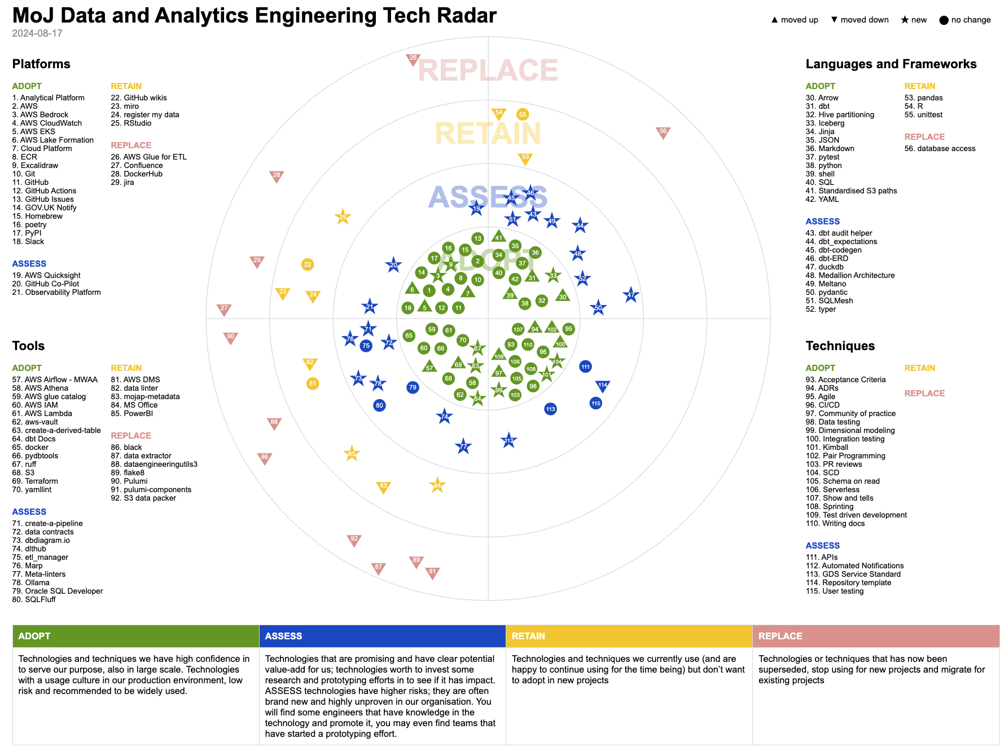

## Why adopt a tech radar?

Choosing which technologies and techniques to adopt can be challenging in the fast-evolving tech landscape, full of fresh SaaS and open-source offerings. There’s a delicate balance between staying up-to-date and retaining popular tools that the team is already familiar and comfortable with.

Our decision to promote the tech radar was guided by these principles.
The tech radar provides a platform for the team to collaborate, evaluate both established and emerging technologies, and make collective decisions. It ensures that all voices are heard while offering a clear vision for the future and guidance for senior leadership.

It also plays a key role in maintaining team flexibility and agility. A unified tech stack opens up opportunities for collaboration and simplifies development across a diverse range of individuals.

While adapting existing infrastructure can be costly, often requiring cross-team coordination and significant time, sticking with outdated solutions just to avoid these expenses isn’t always the best strategy, especially for a smaller team. The tech radar helps us focus on emerging technologies that the wider team is keen to adopt, allowing us to innovate and grow without the burden of legacy tools.

## Ok, so what is a tech radar?

A tech radar is a tool that maps out the key technologies your team is using or considering, represented as “blips.” These blips are arranged into concentric rings - **Adopt, Assess, Retain, and Replace** - which reflect the status of each technology, indicating whether we plan to adopt, phase out, or maintain it and split into quadrants, representing the different kinds of blips - languages, tools, etc.

Originally pioneered by [ThoughtWorks](https://www.thoughtworks.com/radar) and further refined by [Zalando](https://engineering.zalando.com/tags/tech-radar.html), the tech radar provides a visual framework - much like an archery target - for understanding our tech landscape. It helps align technology choices across teams and guides informed decisions about which technologies to continue using or discontinue.

### Current Implementation

Our implementation follows the approach outlined by ThoughtWorks, focusing on the following rings:

- **ADOPT**: Proven technologies and techniques we trust to meet our needs at scale. These are widely used in production, low-risk, and recommended for broad adoption.
- **ASSESS**: Promising technologies with clear potential. These are worth researching and prototyping, though they carry higher risks as they are new and untested in our organisation. Some engineers may already be experimenting with them.
- **RETAIN**: Technologies we currently use and are satisfied with but do not plan to adopt in new projects.
- **REPLACE**: Outdated technologies or techniques that have been superseded. We will stop using them for new projects and plan to phase them out of existing ones.

And split into the following quadrants:
- **Platforms**:
- **Tools**: Key software and technologies. These include ruff and Docker, amongst others.
- **Languages** and Frameworks: Programming languages and common frameworks used in Data Engineering, such as dbt, pyarrow or pyspark.
- **Techniques**: Common techniques used in software development and Data/Analytical Engineering. These include agile, architectural design records (ADRs) and Kimball (for dimensional modelling).

## Our Tech Radar journey

We began our first test run of the tech radar as a simple Miro whiteboarding exercise, where the Data Engineering team came together to identify key technologies and techniques, assigning them to relevant categories. [Add a quick note on why we wanted to migrate away from Miro?] [Snapshot to the miro board]

In 2020, Zalando open-sourced their adapted [tech radar](https://github.com/zalando/tech-radar), which we’ve since adopted. The setup requires only a central JSON file containing details of each blip, including the date, quadrant, and ring it belongs to. This data then automatically populates the radar.

Building on this solution, we’ve explored GitHub integrations to streamline the creation and management of blips, ensuring a clear record of our discussions and decisions.

### Integrations with Github

As a team, we’ve been steadily migrating more of our processes to a unified environment - *GitHub*. Earlier this year, Soumaya, one of our lead Data Engineers, championed its use as a single tool in her article [*Github as a One-Stop Shop*](https://ministryofjustice.github.io/data-and-analytics-engineering/blog/posts/github-as-a-one-stop-shop/), and this shift has gradually spread across the team as we consolidate our tools. It was only natural that we would eventually explore GitHub as a solution for blip creation.

After some experimentation, we eventually decided on an approach that leverages [Github’s discussions](https://docs.github.com/en/discussions/collaborating-with-your-community-using-discussions/about-discussions). Each discussion is given the title according to the blips, with a label (indicating its status) and a category (such as language, tool, or technique).

<Insert image of a discussion post - link through instead - Python black?>

This approach offers several benefits:
- **Centralised history of discussions and decisions**: By using GitHub Discussions, we log all our conversations and radar iterations in one place. This makes it easy to revisit past decisions when reviewing the radar in future exercises and provides clarity on why certain choices were made.
- **Simple radar maintenance**: Thanks to [Github’s GraphQL API](https://docs.github.com/en/graphql/overview/about-the-graphql-api), we can easily extract all the necessary information to populate each blip automatically, streamlining the update process.
- **Direct links to discussions**: Each blip in the radar can be linked to its corresponding GitHub discussion. Clicking a blip takes you directly to the discussion, offering a detailed view of its history, including our thoughts, concerns, and considerations.
- **Asynchronous feedback**: GitHub enables us to collect feedback at any time, facilitating hybrid working practices. Staff can contribute to discussions from any location, making it easier for everyone to engage and have their say.

## Notable Changes from Our Recent Tech Radar Review

Our latest update saw roughly thirty Data and Analytics Engineers come together to discuss our views and perspectives on the existing blips in the radar. To achieve this, we split into groups, each headed by one of our engineers, to review the blips in each quadrant. This method allowed us to cover a lot of ground efficiently while ensuring everyone’s input was considered.

The introduction of our Analytical Engineering function has also led to an increase in the number of blips, reflecting the growing diversity of tools and techniques we use. Here are some key changes from our latest radar review:

### Climbers 🔼

- **dbt**: `dbt` has been a key part of our Data Engineering stack for some time. It has now moved from the Assess ring to the Adopt ring, reflecting its maturity and the team’s increased confidence in its capabilities. We currently have a dedicated team overseeing our internal `dbt` implementation, and its usage is expected to grow.
- **ruff**: Since our initial review back in 2021, `ruff` has matured and gained widespread adoption within the Python community. Due to this, we’ve moved it from the Assess ring to the Adopt ring, highlighting its reliability and growing popularity.

### Fallers 🔽

- **AWS Glue**: AWS Glue has fallen from the **Adopt** ring to the **Replace** ring. While it was once a key tool in our Data Engineering stack, we’ve found it to be less reliable, harder to debug, and more costly compared to other options. We have phased it out in favour of a `dbt` and `Athena` combination, which has proven to be more cost-effective and dependable.
- **Jira/Confluence**: Previously essential to our project management, Jira and Confluence have dropped from **Adopt** to **Replace**. Though still used in parts of the organisation, we are exploring alternatives that better meet our needs and help consolidate our tools.
- **Internal tools**: Several internal tools, such as `dataengineeringutils3` and `etl-manager`, which were developed many years ago but are no longer actively maintained or used, have been moved to the **Replace** ring. We are working to phase these tools out and replace them with more modern, open-source solutions to reduce technical debt and streamline our workflows.

### New Entries ⭐

- **AWS Bedrock**: [To add]
- **dbt ecosystem and SQLMesh**: As part of our effort to improve tooling and processes around `dbt`, we’ve added several packages from the `dbt` ecosystem (including `dbt-codegen` and `dbt-audit-helper`) along with `SQLMesh`. These tools will enhance collaboration and project management within `dbt` workflows.​⬤

## Next steps and reflections

Our second-generation tech radar is both a more functional and automated solution to the challenge of coordinating technology choices across our team.

Looking ahead, we plan to update the radar annually as part of a larger team day. Not only does this serve as a valuable team-building opportunity, but it also gives everyone—including the most junior members—a chance to shape how we work.

Despite the radar’s success, there are still challenges to address. Beyond the administrative workload, several key areas require further attention:
- **Automated CI for blip updates**: As our tech radar is now fully built and deployed in GitHub, it would be good to automate the process of updating blips via continuous integration.
- **Labelling and filtering blips**: With the introduction of an Analytics Engineering function to our Data Engineering team, we’ve experienced a surge in the number of blips. We are exploring ways to add more structure or filter, to help distinguish between different professions.
- **Maintaining relevance**: A key issue we have yet to tackle is ensuring the radar is used in the decision making process and remains relevant.

We’re also keen to bring in fresh perspectives and suggestions we may not have considered. Currently, we’re exploring how to incorporate features from the [AOE tech radar](https://www.aoe.com/techradar/) (another open-source solution) in collaboration with one of our software teams at the Ministry of Justice.
