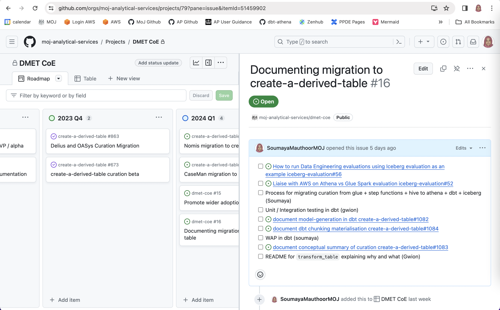

<div class="govuk-warning-text">
  <span class="govuk-warning-text__icon" aria-hidden="true">!</span>
  <strong class="govuk-warning-text__text">
    <span class="govuk-warning-text__assistive">Warning</span>
    This blog is under development.
  </strong>
</div>
</p>

The following Development Environment Setup will be familiar to many developers:

- [GitHub repositories](https://docs.github.com/en/repositories/creating-and-managing-repositories/quickstart-for-repositories) to store and manage your code
- [Jira](https://www.atlassian.com/software/jira) to plan, track and prioritise work
- [Confluence](https://www.atlassian.com/software/confluence) to store and manage technical documentation
- [Miro] for whiteboarding
- Powerpoint to create slide decks and stored on Sharepoint / Google Drive
- Excel to record user approval testing (UAT) and stored on Sharepoint / Google Drive

This leads to scattered deliverables, causing confusion, slowdowns, and increased risk of inconsistencies. This article summarises how to consolidate all your project artefacts in GitHub by leveraging recent GitHub features and open-source tools: 

- [GitHub Projects](https://docs.github.com/en/issues/planning-and-tracking-with-projects/learning-about-projects/about-projects) for planning and tracking work and completing UAT
- [GitHub Discussions](https://docs.github.com/en/discussions) for documenting discovery work and communicating with your users
- `/docs` folder for documenting user guidance and technical concepts in markdown
- [mermaid](https://docs.github.com/en/get-started/writing-on-github/working-with-advanced-formatting/creating-diagrams) for creating (simple) diagrams using markdown-like syntax 
- [excalidraw](https://excalidraw.com/) (and [VS Code extension](https://marketplace.visualstudio.com/items?itemName=pomdtr.excalidraw-editor)) for creating editable diagrams and whiteboard sketches which can be saved as code
- [marp](https://marp.app/) for creating slide decks in markdown which can be saved as code

Those internal to MOJ can access various use cases linked in the Excalidraw whiteboard below:

<a href="https://excalidraw.com/#url=https://raw.githubusercontent.com/ministryofjustice/data-and-analytics-engineering/add-github-blog/src/content/blog/posts/images/github-one-stop-shop.excalidraw.png"></a>

This article lists some recommendations on how to use these tools as of February 2024. For more detailed and/or up-to-date instructions please refer to the links provided. If you have any comments and/or suggestions please post on the [GitHub Discussion](https://github.com/ministryofjustice/data-and-analytics-engineering/discussions/10).

# Why store everything in GitHub?

The tools discussed in this article can have less features and may involve a steeper learning curve than your existing setup. In addition, there aren't clear migration paths which means that unless you're starting from scratch it can be painful to move accross.

However, there are various advantages which makes it worthwhile:

### Searching

Gathering all your code, tickets, documentation, and presentations in one place makes it super easy to search through everything, *if you can find it*. However, GitHub Code Search which was first released in [2008](https://github.blog/2021-12-15-a-brief-history-of-code-search-at-github/) used to [suck](https://github.com/isaacs/github/issues/908). GitHub rolled out a new code search engine and browser in [November 2022](https://github.blog/changelog/2022-11-09-introducing-an-all-new-code-search-and-code-browsing-experience/), finally enabling users to find relevant results at reasonable speed and turning GitHub into a viable developer hub.

### Interoperability

Using GitHub tools exclusively makes it easier to link and automate across your project artefacts. Hence it makes it easier to track, review and deploy changes as well as collaborate with your team and users.

### Standardisation

Treating project [deliverables as code](https://thenewstack.io/why-docs-as-code-should-be-part-of-your-dev-cycle/) means you can leverage the same practices that are applied to software development: version control, automation, reusability and maintainability. This leads to improved standardization and quality across your projects and enterprise.

### Cost

You company may save money by no longer needing licenses for redundant tools like JIRA and Atlassian. However, this benefit is less significant if your company still has to pay for licenses for teams that don't use GitHub and are unlikely to switch.

# Project Management

In [August 2022](https://github.blog/2022-07-27-planning-next-to-your-code-github-projects-is-now-generally-available/) Github released the new version of [GitHub Projects](https://docs.github.com/en/issues/planning-and-tracking-with-projects/learning-about-projects/about-projects) which summarises GitHub repository issues and PRs through a more intuitive GUI. Whilst [Projects Classic](https://docs.github.com/en/issues/organizing-your-work-with-project-boards/managing-project-boards/about-project-boards) were tied to a repository, Projects V2 are created at the GitHub organization level. This means they can be linked to a repository, but are independent of them. You can also add issues from [different GitHub organisations](https://github.blog/changelog/2023-02-23-github-issues-projects-february-23rd-update/#add-cross-organization-issues-and-pull-requests-to-projects), but there won't be a backwards-link on the issue to the project.

There are various ways to [automate](https://docs.github.com/en/issues/planning-and-tracking-with-projects/automating-your-project) your projects. The simplest are the [built-in automations](https://docs.github.com/en/issues/planning-and-tracking-with-projects/automating-your-project/using-the-built-in-automations), for example to update the status to "Done" when an issue is closed.

### Epics

One missing feature is the ability to group issues into epics. There are three work-arounds:

#### 1. Task Lists

[Task lists](https://docs.github.com/en/get-started/writing-on-github/working-with-advanced-formatting/about-task-lists) have been around since [2014](https://github.blog/2013-01-09-task-lists-in-gfm-issues-pulls-comments/). GitHub is currently working on [a significant upgrade](https://docs.github.com/en/issues/managing-your-tasks-with-tasklists) which is still in private beta so watch this space!

Task Lists allow you to break down large issues and discourage the creation of many microscopic issues:

```
- [x] #739
- [ ] https://github.com/octo-org/octo-repo/issues/740
- [ ] Add delight to the experience when all tasks are complete :tada:
```


You can link to within-repo issues, PRs and discussions using the more simple "#number" pattern. For cross-repo linking you'll have to specify the full url. You can also draft tasks until you're ready to convert them to an issue, PR or discussion.

You can navigate back to the parent issue in the "Tracked by: section next to the child issue status:


I recommend assigning an "Epic" label to parent issues to make them easier to identify. You can display the "Epic" label in GitHub Projects, and filter and/or search by the "Epic" label. You cannot view relationships (yet) on GitHub Project(s) directly but it's relatively easy to view by opening the issue screen:



#### 2. Milestones

[GitHub Milestones](https://docs.github.com/en/issues/using-labels-and-milestones-to-track-work/about-milestones) can be associated with issues and PRs, but not discussions. You can display milestones on GitHub Projects as an additional column, or add them to the Github Project [Roadmap layout](https://docs.github.com/en/issues/planning-and-tracking-with-projects/customizing-views-in-your-project/changing-the-layout-of-a-view#about-the-roadmap-layout.)

Whilst cross-repo milestones [are not yet supported](https://github.com/orgs/community/discussions/6296), you could consider recording all your issues in your "core" repo, even if the code is split amongst multiple repos. This is general good practice and makes it easier to manage work.

#### 3. Labels

Don't use [GitHub Labels](https://docs.github.com/en/issues/using-labels-and-milestones-to-track-work/managing-labels) for epics! This may seem an obvious option at first, but like GitHub Milestones you can't create org-wide labels, and unlike Milestones you can't set dates and track completion status.

### Roadmaps

The Github Project [Roadmap layout](https://docs.github.com/en/issues/planning-and-tracking-with-projects/customizing-views-in-your-project/customizing-the-roadmap-layout) displays the project items on a timeline.

I personally prefer using the [View layout](https://docs.github.com/en/issues/planning-and-tracking-with-projects/customizing-views-in-your-project/customizing-the-board-layout), and grouping issues by execution "quarter". You can modify the "status" field to store the quarter, as used in the [GitHub Public Roadmap](https://github.com/orgs/github/projects/4247). Alternatively you can create a separate "Quarter" field.

Using quarters instead of dates encourages product owners/delivery managers to follow good practice such as:

- Create epics which are shorter than a quarter
- Limit the number of epics undertaken per quarter
- Give less precise but more accurate start and completion dates

### Requirement Analysis

The [MoSCoW method](https://www.techtarget.com/searchsoftwarequality/definition/MoSCoW-method) prioritizes project requirements by splitting them into *must haves*, *should haves*, *could haves* and *will not haves*. This can be done within GitHub Projects by creating a new "MoSCoW" field with the relevant labels. The items can start off as drafts, and can be later converted into issues once more fleshed out.

### User Approval Testing (UAT)

User Approval Testing can take many forms. A common scenario is migrating a large group of users to a new solution, and making sure that existing functionality is replicated. A simple way of tracking progress is through an excel spreadsheet with a row per user and columns for recording completion of different actions.

We have successfully used GitHub Projects for tracking user migration to a new database. Those internal to MOJ can access this private [project](https://github.com/orgs/moj-analytical-services/projects/72/views/1) as an example. For those external, the concept is simple; 

1. Create an [issue template](https://docs.github.com/en/communities/using-templates-to-encourage-useful-issues-and-pull-requests/configuring-issue-templates-for-your-repository) to summarise the different actions
1. Create a ticket per artefact that needs to be migrated
1. Replace the "status" field with different actions
1. Use the "view layout" to track progress

The advantages are many:

- Assign tickets to GitHub user accounts, instead of named individuals
- Use a single issue to track progress and communication
- Take advantage of [GitHub automation](https://docs.github.com/en/issues/planning-and-tracking-with-projects/automating-your-project) where possible

# Project Documentation

Documentation about your project can take many forms, which needs to be recorded and/or managed differently depending on the audience and use case.

### Documentation about your code

This is obvious, and should reside in your code. Good code documentation practice is outside the scope of this article, please refer to [swim](https://swimm.io/learn/code-documentation/documentation-in-python-methods-and-best-practices) for some great pointers.

### Documentation about your project  

This includes architecture, dependencies, setup instructions, usage guide, etc... You can keep this information in GitHub as markdown files in a `/doc` folder in your GitHub repository. It's also possible to use [GitHub wikis](https://docs.github.com/en/communities/documenting-your-project-with-wikis), as has been successfully achieved [here](https://github.com/AstroBookings/.github/wiki). However I would not recommend for reasons which are best summarised in this [article](https://michaelheap.com/github-wiki-is-an-antipattern/). 

You have the option to convert your docs into a static website using static site generators such as [mkdocs-material](https://squidfunk.github.io/mkdocs-material/) and host on [GitHub pages](https://docs.github.com/en/pages/getting-started-with-github-pages/about-github-pages).

Whilst it's recommended for documentation to go through the same review process as code, it can sometimes feel onerous. You can modify the [codeowners](https://docs.github.com/en/repositories/managing-your-repositorys-settings-and-features/customizing-your-repository/about-code-owners) to skip the approval process for changes to the `/docs` folder. You can also modify [GitHub workflows](https://docs.github.com/en/actions/using-workflows/workflow-syntax-for-github-actions#onpull_requestpull_request_targetbranchesbranches-ignore) to skip the workflow, which is useful in the case of long running tests.  

A few things to note about structuring the `/docs` folder:

- If your team/application a mono-repo layout, you can split off into multiple `/docs` folders at the root of each sub-folder, but this can make it more complex to manage and navigate.
- If your team/application uses a multi-repo approach, you can use the "core" repo or create a "docs" repo for documenting team/application level documentation. It won't be possible to make code and documentation changes made against different repos in a single PR, but you can still link the changes as child-tickets to the same Epic.

### Documentation about your approach

This refers to transient documentation that is generated whilst you are considering different options, running some analysis etc... This documentation should not reside in your code because it will lead to clutter and cause confusion, especially for new team members. The `/docs` folder should reflect the "current" status of your project, just like your code.

Instead, you can use [GitHub Discussions](https://docs.github.com/en/discussions/collaborating-with-your-community-using-discussions/about-discussions) which was released in [Aug 2021](https://github.blog/2021-08-17-github-discussions-out-of-beta/). This feature is not enabled by default so you'll have to update the [repository settings](https://docs.github.com/en/repositories/managing-your-repositorys-settings-and-features/enabling-features-for-your-repository/enabling-or-disabling-github-discussions-for-a-repository). If your team/application uses a multi-repo approach, you could limit the GitHub Discussions to the "core" or "docs" repo to make it easier to track/search.

Unlike the `/docs` folder, approvals are not required. Whilst it makes the workflow simpler, it does mean that Discussions can become an "information swamp". Hence you need a process for migrating condensed information to the `/docs` folder. Thankfully GitHub Discussions support the same [advanced formatting](https://docs.github.com/en/get-started/writing-on-github/working-with-advanced-formatting) as markdown pages which makes it easy to copy and paste. I recommend closing a Discussion once the summary has been migrated to the `/docs` folder.

GitHub Discussions allows your users to [participate](https://docs.github.com/en/discussions/collaborating-with-your-community-using-discussions/participating-in-a-discussion) with the idea-generation process, via comments, reactions and polls. However this means your team and your users will need to check their GitHub notifications regularly. It can also cause confusion if you already use another communication medium e.g. Slack. A good rule of thumb is whether you might want to refer to this information in one year's time. If yes, use a GitHub discussion!

### Diagrams

[Mermaid](https://github.com/mermaid-js/mermaid#readme) is a JavaScript-based diagramming tool for creating diagrams using a markdown-like syntax. GitHub released support for Mermaid in [Feb 2022](https://github.blog/2022-02-14-include-diagrams-markdown-files-mermaid/). Mermaid is particularly useful when you want to include an editable diagram in places like issues and discussions, as you don't have to save it to the `docs` folder. However I found that Mermaid has a steep learning curve and limited options available so I would only suggest for really simple diagrams. 

Instead, I recommend using [Excalidraw](https://excalidraw.com/), an open-source whiteboard for sketching. GitHub does not provide native support to Excalidraw, but you can export the drawing as an editable image file (PNG/SVG) or JSON file. You can then embed the file directly to issues and discussions, or save it to the `/docs/images` folder for version control. You can edit the diagram on the web editor or download the [VS Code extension](https://marketplace.visualstudio.com/items?itemName=pomdtr.excalidraw-editor) to edit locally. Excalidraw + GitHub is also great for recording the outcome of collaborative whiteboard sessions which often get thrown away.

### Presentations

[marp](https://marp.app/) is a open-source "ecosytem" for creating slide decks in markdown. Like Excalidraw, GitHub does not provide native support, but you can download the [VS Code extension](https://marketplace.visualstudio.com/items?itemName=pomdtr.excalidraw-editor) to edit and render the markdown file locally. There is a bit of learning curve, but once you've decided on a format it's very intuitive. We've used it succesfully to create three different slide decks in [iceberg-evaluation](https://github.com/moj-analytical-services/iceberg-evaluation). I've also exported the README.md and hosted on [GitHub Pages](https://moj-analytical-services.github.io/iceberg-evaluation/) for easy acces.

# Acknowledgements

I would like to thank the following people:

- The managed pipelines team for being so open-minded about trying out new things
- @bagg3rs for introducing me to Excalidraw
- @julialawrence for encouraging me to give GitHub Projects another try